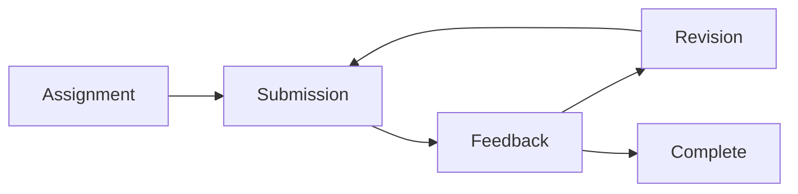
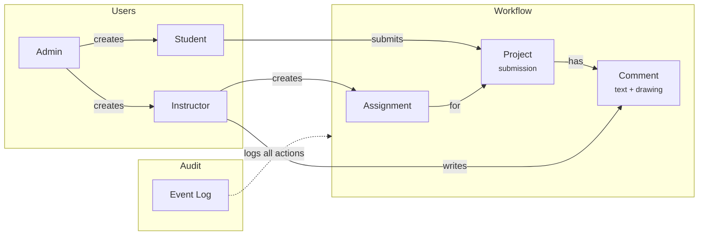

# ReVideo

**Video review platform for education** · Beta

Instructors create assignments, students submit videos, instructors give timestamped feedback with drawing annotations. Students revise and resubmit. Self-hosted, no external dependencies.

🌐 Website: [revideo.cc](https://revideo.cc)

## Problem

You teach a video course. Students submit films, documentaries, news packages, dance recordings. You need to give frame-precise feedback: "fix the audio here", "try a different cut there", "the composition looks off at this moment".

Email doesn't work. Vimeo review links expire. Frame.io costs $25/month per seat. YouTube comments have no timestamps. You end up writing "at 2:34..." over and over.

## Solution

ReVideo is a single-container platform for the assignment-submission-feedback loop. Instructor creates an assignment. Student uploads video. Instructor clicks anywhere on the timeline to leave a timestamped comment with optional drawing annotations. Student sees markers on the timeline, clicks to jump. Uploads a new version. Repeat until done.

No project management. No team features. No dashboards. Just structured video feedback.

Self-hosted: universities can deploy on their own servers. All data (videos, comments, user accounts) stays within the institution. No cloud dependencies, no external services, no data leaving campus.



## How it works

```
1. Instructor creates assignment        Define the task, set expectations
           ↓
2. Student uploads video               Transcoded to HLS for smooth playback
           ↓
3. Instructor reviews                  Timestamped comments, drawing annotations
           ↓
4. Student sees feedback               Click markers on timeline, see annotations overlaid
           ↓
5. Student uploads new version         Revised video based on feedback
           ↓
6. Instructor reviews again            Repeat until done
           ↓
7. Complete                            Full revision history preserved, all feedback accessible
```

## Features

- **Timestamped comments**: click anywhere on timeline, millisecond precision
- **Drawing annotations**: freehand brush, arrows, multiple colors, saved with comments
- **HLS streaming**: videos transcoded for instant seeking, no buffering
- **Visual timeline**: orange markers show where comments are, click to jump
- **Version history**: students upload new versions, previous submissions preserved
- **Mobile-friendly**: students view feedback on any device
- **Activity logging**: track all actions (views, comments, uploads), full audit trail
- **Magic link auth**: no passwords for users, secure email-based authentication

## Use Cases

**Film and video courses**: student films, documentaries, editing exercises, cinematography assignments.

**Journalism programs**: news packages, interviews, standups, broadcast journalism training.

**Performance arts**: dance, theater, music recordings, technique feedback.

## Domain Model



**Roles:**
- **Admin**: platform administrator, creates instructors and students
- **Instructor**: creates assignments, reviews submissions, writes comments
- **Student**: submits videos, views feedback, uploads revisions

## Architecture

```
┌─────────────────────────────────────────────────────────┐
│                     Container                            │
│  ┌───────────────────────────────────────────────────┐  │
│  │                Nginx (port 80)                     │  │
│  │    /         → Frontend (Vue.js)                   │  │
│  │    /admin/   → Admin Panel (Vue.js)                │  │
│  │    /api/     → Backend (Spring Boot)               │  │
│  └───────────────────────────────────────────────────┘  │
│                          │                               │
│  ┌──────────────┐  ┌─────┴──────┐  ┌──────────────┐    │
│  │  PostgreSQL  │  │  Backend   │  │   Mailpit    │    │
│  │    :5432     │  │   :8080    │  │    :8025     │    │
│  └──────────────┘  └────────────┘  └──────────────┘    │
│                                                          │
│  ┌───────────────────────────────────────────────────┐  │
│  │               /data (volume)                       │  │
│  │   postgres/   │   uploads/   │   mailpit/          │  │
│  └───────────────────────────────────────────────────┘  │
└─────────────────────────────────────────────────────────┘
```

Single container with all services. No external dependencies. Works on Intel and ARM.

## Technology

### Backend
- Java 21, Spring Boot 3.x
- PostgreSQL 16, Flyway migrations
- Spring Security, JWT authentication
- FFmpeg for HLS transcoding
- Local storage or AWS S3
- HMAC-SHA256 signed URLs for secure video access

### Frontend
- Vue 3, Composition API
- TypeScript
- HLS.js for video streaming
- Canvas API for drawing annotations
- Tailwind CSS
- Vite

### Infrastructure
- Single Docker container
- Nginx reverse proxy
- Supervisor process manager
- Role-based access control
- Rate limiting
- Full audit logging

## Demo

Run locally with Docker. Single container with everything included. Works on Intel and ARM.

```bash
docker pull ghcr.io/kalba-lab/revideo:latest

docker run -d -p 80:80 -p 8025:8025 -v revideo_data:/data --name revideo ghcr.io/kalba-lab/revideo:latest
```

| Service | URL |
|---------|-----|
| App | http://localhost/ |
| Admin | http://localhost/admin/ |
| Email (dev) | http://localhost:8025 |
| API docs | http://localhost/swagger-ui/index.html |

Default credentials: admin@localhost / admin123

---

✉️ [min@kalba.dev](mailto:min@kalba.dev?subject=ReVideo) · [Kalba Lab](https://kalba.dev)
